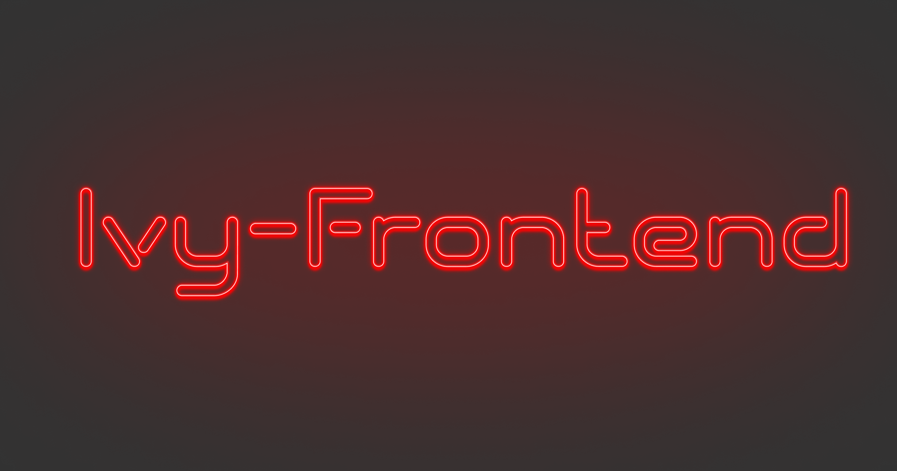

<p>
    
</p>

<p align="center">
    
    
    
    
</p>

# Ivy - Frontend

The frontend for the `Ivy Chess Manager` project.
Provides an interface for the [backend](https://github.com/HenrikThoroe/ivy-backend).

## 🎉 Motivation

The backend provides many features to manage, train and compare different chess engines.
To put good use to all these features a neat frontend is required!
The repo contains a NextJS application to access the backend and upload, download,
train and compare engines.

## 📖 Project Overview

The projects is following the NextJS 13+ `app` folder structure.
Reusable components are placed under `/components`. Logic can be found under `/lib`.

The component directory follows a fixed structure:

- Groups are named `(<name>)`
  - A group is a collection of logically related components
- Components with name `A` are saved as `A/A.tsx`.
- Each component has a coresponding `Comp.stories.ts(x?)` file
  - See [storybook](https://storybook.js.org)
  - The story is placed in the components directory
- Any logic or extracted sub-component is placed in the components directory
  - Sub components are usually implemented as nested arrow functions, but sometimes they need their own directory
  - Sub components should not be imported by other components as they only make sense in the components context

## 🔥 Getting Started

### Install Prerequisites

- [NodeJS](https://nodejs.org/en/download) (v18.12+, recommended v20+)
- [Yarn](https://yarnpkg.com/getting-started/install) (v3+ is required. Use `yarn set version stable`)

### Setup Dev Environment

```sh
# Install dependencies
yarn install

# Start dev server in watch mode
yarn dev

# Run component inspector
yarn storybook
```

## 🧑‍⚖️ License

This project and all components of it are distributed under GPLv3 or later.
See `LICENSE` for more details. In summary the license allows anyone to use and redistribute
this project as long as the code is again published under GPLv3.
